# FunBot

```text
0110011001    10      10    01      01    10011001        100110      1001100110
10            01      01    1001    10    01      01    10      10        01
01            10      10    0110    01    10      10    01      01        10
10011001      01      01    10  10  10    01100110      10      10        01
01            10      10    01    1001    10      10    01      01        10
10            01      01    10    0110    01      01    10      10        01
01              011001      01      01    10011001        100110          10
```

本地运行的 Anubis 主网多钱包竞技场工具。通过 EIP-7702，由一个主号管理多个子号。

- **本地管理**：助记词、私钥在终端导入，加密保存在本机。
- **批量操作**：按组选择账号，完成委托、入册、打局和收益归集。
- **独立账号组**：一个文件夹管理一组钱包，主号可选择是否参赛。

## 使用导航

第一次使用：**[Windows 教程](#windows-教程)** · **[Mac 教程](#mac-教程)** → **[页面操作](#页面操作)**

日常管理：[多组账号](#多组账号管理) · [启动与备份](#日常使用) · [常见问题](#常见问题)

进阶阅读：[使用与审核参考](docs/REFERENCE.md) · [MIT 许可证](LICENSE)

只需安装自己电脑对应的 Go 环境，下载源码后编译。命令逐条复制、回车，等执行结束再继续。

> **目录说明**：源码文件夹用来编译；账号组文件夹放编译好的 `funbot`，用来导入钱包和运行程序。

## Windows 教程

### 1. 下载并解压源码

打开 [fun-tool/funbot](https://github.com/fun-tool/funbot)，点击 **Code → Download ZIP**。右键下载的 ZIP，选择“全部解压”。

打开解压后的源码文件夹，以能直接看到 `go.mod`、`main.go` 和 `public` 为准；文件夹名称以实际下载结果为准。

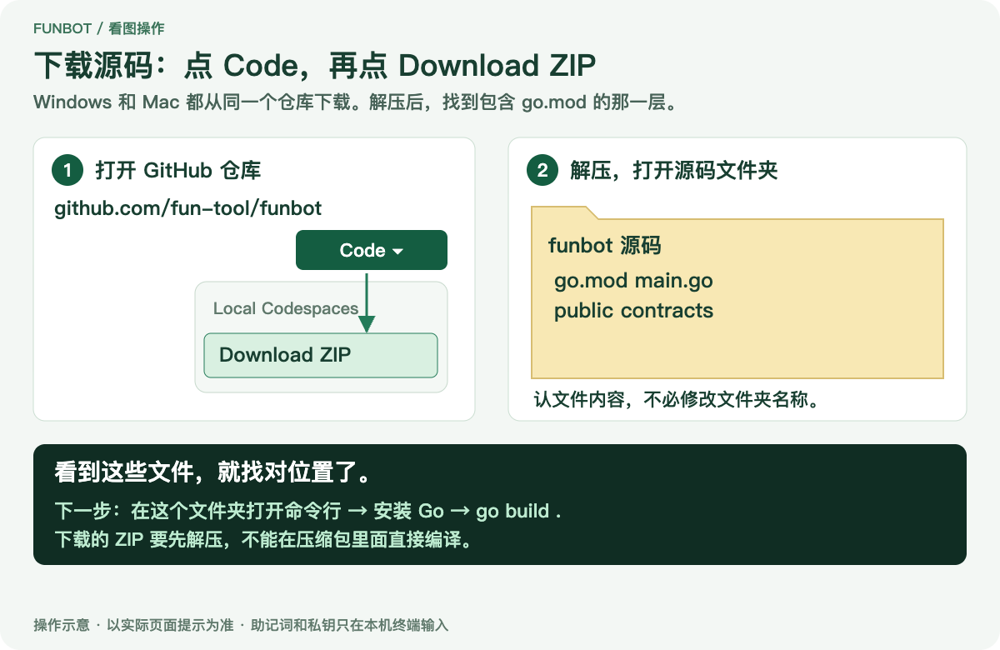

### 2. 打开命令行

在源码文件夹顶部的 **地址栏** 输入 `powershell`，按回车。不要输入到右侧搜索框。

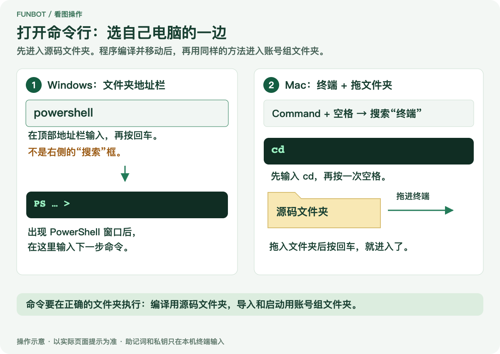

### 3. 安装 Go

```powershell
winget install --id GoLang.Go --exact --source winget
```

安装完成后关闭 PowerShell，按第 2 步重新打开，检查版本：

```powershell
go version
```

需要 Go **1.26.8 或更高版本**。

找不到 `winget` 时，到 [Go 官网](https://go.dev/dl/) 下载安装包，双击安装：

- **Intel / AMD 电脑**：选 `windows-amd64.msi`。
- **ARM 电脑**：选 `windows-arm64.msi`。

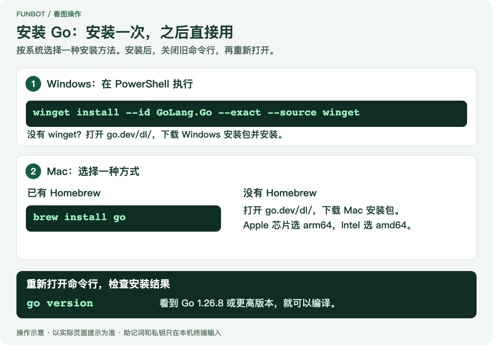

### 4. 编译

在能看到 `go.mod` 的源码文件夹中执行：

```powershell
go build .
```

`.` 表示编译当前目录。第一次会下载依赖；命令执行完且没有报错，回到文件夹查看新生成的程序。

找到新增的 `funbot`，类型为“应用程序”，不用改文件名。拖动的是这个程序文件。

### 5. 建立账号组文件夹

在桌面新建一个文件夹，例如 **账号组A**。用鼠标把刚编译的 **`funbot`** 拖进去即可，网页已包含在程序中，不用搬源码和 `public`。

打开“账号组A”，在顶部地址栏输入 `powershell`，回车。

后面的命令都在这个新文件夹里执行。

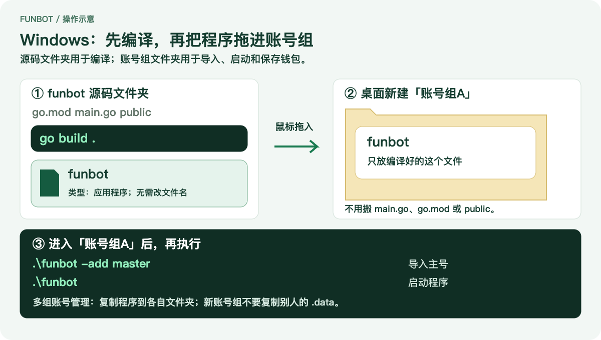

### 6. 导入主号

```powershell
.\funbot -add master
```

按终端提示完成：

1. 设置密钥文件密码，至少 8 位。
2. 输入助记词或私钥，按回车。
3. 核对地址，正确时输入 `y`，再填写备注。

看到“已加入”即导入成功。以后导入和解锁使用同一个密码。

> 输入密码、助记词、私钥时不显示文字或星号，填完按回车即可。

子号与主号使用同一组助记词时，进入页面后派生即可。

**可选：导入其他助记词或私钥的子号**

在当前账号组文件夹执行：

```powershell
.\funbot -add member
```

输入原密钥文件密码，再输入子号的助记词或私钥。可以连续导入，全部完成后空行回车结束。

每组助记词先导入第 0 个地址，其余地址在页面派生。每个账号组只有一个主号，添加子号使用 `member`。


### 7. 启动程序

```powershell
.\funbot
```

浏览器会自动打开。保留 PowerShell 窗口，接着按下方 [页面操作](#页面操作) 完成设置。

## Mac 教程

### 1. 下载并解压源码

打开 [fun-tool/funbot](https://github.com/fun-tool/funbot)，点击 **Code → Download ZIP**，双击 ZIP 解压。

打开解压后的源码文件夹，以能直接看到 `go.mod`、`main.go` 和 `public` 为准；文件夹名称以实际下载结果为准。

### 2. 打开终端

按 `Command + 空格`，搜索“终端”并打开。输入 `cd `（后面有一个空格），把源码文件夹拖进终端，再按回车。


### 3. 安装 Go

已经安装 Homebrew 的电脑，执行：

```sh
brew install go
```

没有 Homebrew 时，到 [Go 官网](https://go.dev/dl/) 下载安装包，双击安装：

- **Apple 芯片**：选 `darwin-arm64.pkg`。
- **Intel 芯片**：选 `darwin-amd64.pkg`。

安装完成后关闭终端，按第 2 步重新打开并进入源码文件夹，检查版本：

```sh
go version
```

需要 Go **1.26.8 或更高版本**。

### 4. 编译

在能看到 `go.mod` 的源码文件夹中执行：

```sh
go build .
```

`.` 表示编译当前目录。第一次会下载依赖；命令执行完且没有报错，回到文件夹查看新生成的程序。

找到新增的 `funbot` 文件，没有后缀，类型为“Unix 可执行文件”，通常显示终端样式图标。拖动的是这个程序文件。

### 5. 建立账号组文件夹

桌面新建文件夹，例如 **账号组A**。用鼠标把刚编译的 **`funbot` 文件** 拖进去即可，不用搬源码和 `public`。

回到终端，输入 `cd `，把“账号组A”文件夹拖进终端，按回车。

后面的命令都在这个新文件夹里执行。

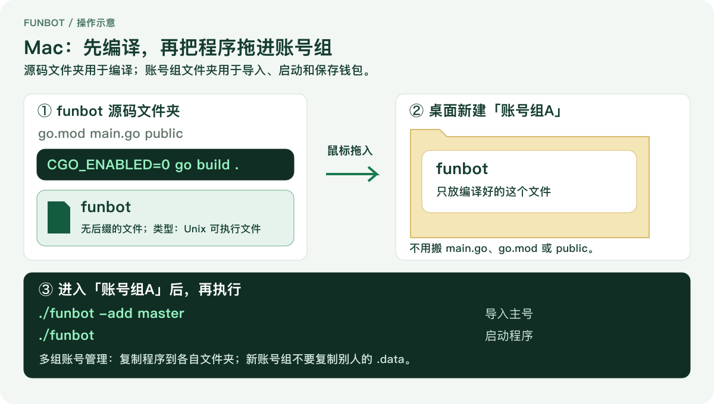

### 6. 导入主号

```sh
./funbot -add master
```

按终端提示完成：

1. 设置密钥文件密码，至少 8 位。
2. 输入助记词或私钥，按回车。
3. 核对地址，正确时输入 `y`，再填写备注。

看到“已加入”即导入成功。以后导入和解锁使用同一个密码。

> 输入密码、助记词、私钥时不显示文字或星号。可用 `Command + V` 粘贴，填完按回车即可。

子号与主号使用同一组助记词时，进入页面后派生即可。

**可选：导入其他助记词或私钥的子号**

在当前账号组文件夹执行：

```sh
./funbot -add member
```

输入原密钥文件密码，再输入子号的助记词或私钥。可以连续导入，全部完成后空行回车结束。

每组助记词先导入第 0 个地址，其余地址在页面派生。每个账号组只有一个主号，添加子号使用 `member`。


### 7. 启动程序

```sh
./funbot
```

浏览器会自动打开。保留终端窗口，接着完成下面的页面操作。

## 页面操作

Windows 和 Mac 使用同一套页面。首次使用按下面的步骤准备，之后只需启动、解锁即可。

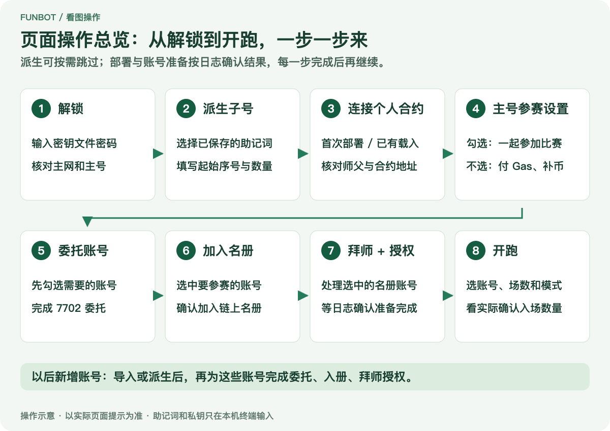

### 1. 解锁

打开“设置”，输入导入时设置的密钥文件密码，点击“解锁”。确认显示“主网”，并核对主号地址。

浏览器没有自动打开时，复制终端打印的 **完整本地链接** 到浏览器，保留末尾的 `?t=...`。每次启动使用当次的新链接。

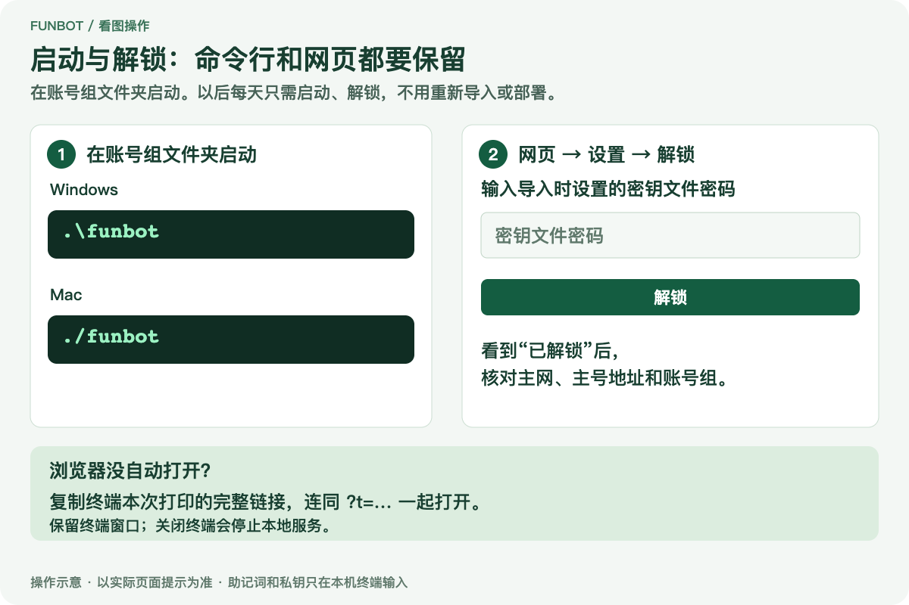

### 2. 派生子号

进入 **设置 → 从已保存的助记词派生钱包**，选择要使用的助记词组。

例如主号与子号来自同一组助记词，要组成“1 个主号 + 23 个子号”，填写：

- **助记词组**：选择主号所在的助记词组。
- **起始序号**：填 `1`。**派生数量**：填 `23`。
- **备注前缀**：例如填「队员」。
- **密钥文件密码**：填写导入时设置的密码。

点击 **派生并加密保存**。第 0 个地址已导入为主号，这次新增第 1～23 个地址。

子号来自另一组助记词时，选择之前用 `-add member` 导入的那一组。它的第 0 个子号已存在；例如还需 23 个子号，同样从 `1` 开始派生 `23` 个。

页面不需要输入助记词。单个私钥不能派生；只导入了私钥的账号可直接继续下一步。

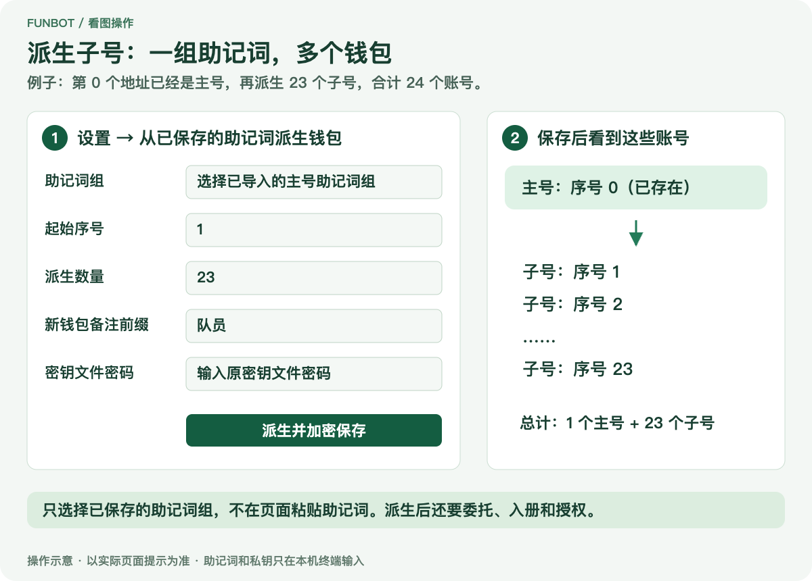

### 3. 部署或载入合约

主号先准备本链 Gas 币，用于部署和交易；游戏入场使用 fLGNS。

在“设置 → 合约”：

**首次部署**：在「新部署一个」填写符合游戏要求的师父地址，点击「部署」，核对提示后确认，等待日志显示成功。

**载入已有合约**：填写这个主号的个人 Squad 地址，点击「载入」，无需重新部署。

师父栏留空时使用主号，主号必须满足游戏的师父资格。

> 拜师关系绑定后不能更改，提交前请核对地址。

部署成功后合约地址自动保存。“合约”栏填个人 Squad 地址，不是游戏 Arena 或代币地址。

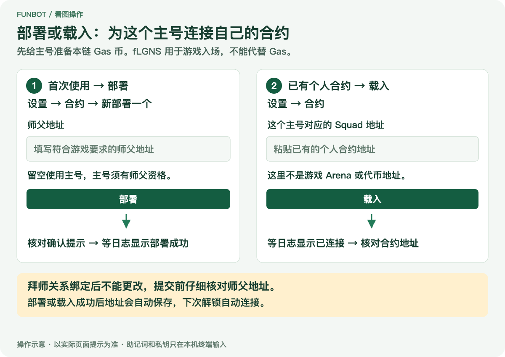

### 4. 选择主号是否参赛

打开「参赛设置」，找到「主号参加比赛」。

**开启**时，主号与子号一起参赛，放在第一组最前面。

**关闭**时，主号只负责支付 Gas、补币和收款，单独显示在最上面。

设置自动保存。账号按顺序每 24 个一组，最后一组可以不足 24 个。

### 5. 委托、加入名册、拜师授权

在“账号设置”勾选要使用的账号，可以选本组、跨组选中，或输入范围，例如 `5` 到 `15`（共 11 个）。

依次点击，每一步都等日志确认成功再继续：

1. **委托选中账号**：完成 EIP-7702 委托，由主号支付 Gas。

2. **选中账号加入名册**：把要参赛的账号加入链上名册。

3. **拜师 + 授权**：为尚未拜师的账号绑定师父，并授权擂台使用 fLGNS 支付入场费。

主号尚未委托时，第 1 步会自动一并处理。主号要参赛，第 2 步还需勾选主号并开启参赛设置。

授权使用最大额度，正常使用基本不会耗尽。额度不足时，重新点击 **拜师 + 授权**；已绑定的师父不会更改。

> 新增账号也要完成这三步。导入或派生只保存本地钱包。

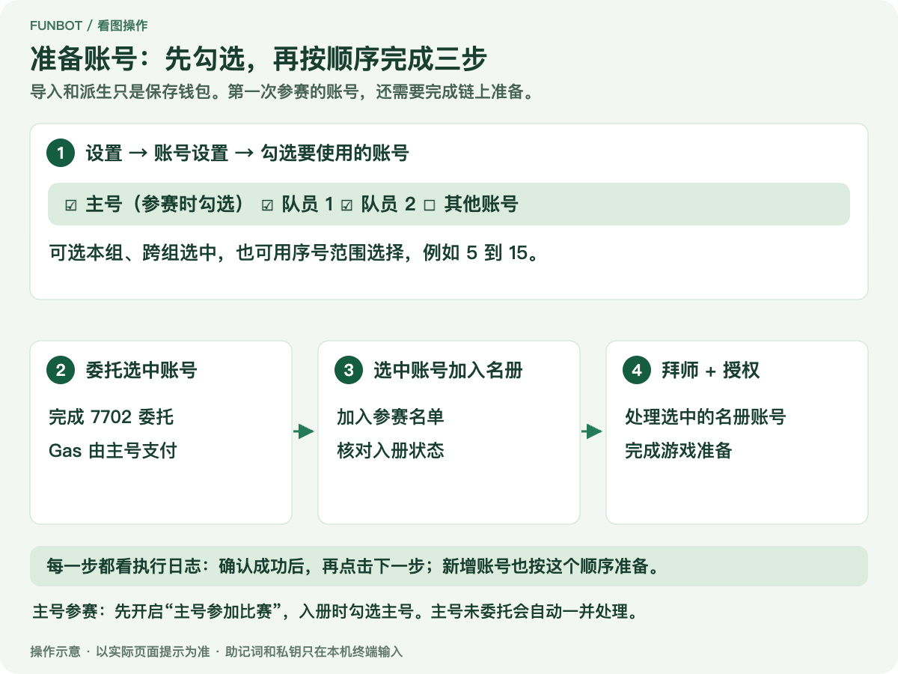

### 6. 开始打局

切换到 **跑**，勾选要参赛的账号，再选择场数和入场方式：

- **场数**：每个号再打最多多少场，当天累计最多 12 场。
- **能打就打**：能入场的先打。选 1 场时处理一批后结束，不等占位账号补打。
- **等齐再打**：整批选中账号模拟通过后一起提交，可能需要等待；不保证进入同一个局号。

点击 **开跑**，在执行日志中查看实际入场数量和完成状态。

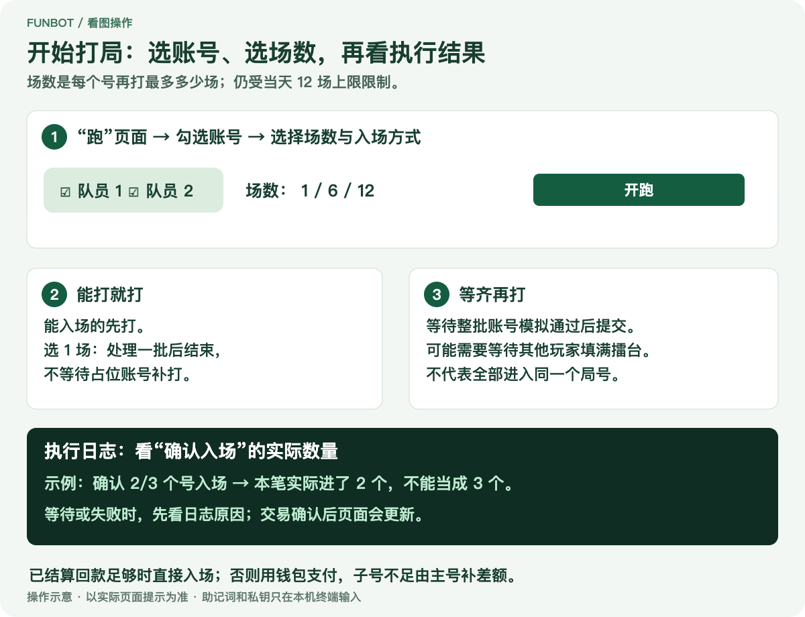

**入场资金**

- 已结算回款够入场费时，直接用回款入场。
- 回款不够时，从钱包支付整笔入场费；子号钱包不足，由主号补差额。
- 未结算押金暂时不能用于入场。

**需要提前转币时**，填写每人金额，点击 **批量转入**。例如选 3 个子号、填写 `100`，每个子号增加 100，共转入 300；主号自动跳过。

**盟主次数**显示该地址累计已裁决的胜出次数；读取失败显示“—”。

### 7. 手动领取与归集

勾选要收款的账号，点击 **领取收益并归集**。

程序会领取甲子俸、师徒收益和可领取的擂台回款，再把可用 fLGNS 转给主号。未结算押金需要满足合约条件后才能收回。

打局不会自动归集。“收 gas 币”是另一项操作，使用前核对选中账号和确认提示。

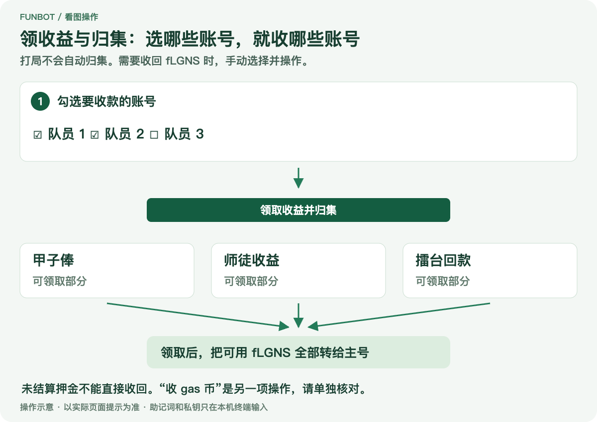

## 多组账号管理

一个文件夹，就是一组独立账号。只需编译一次，再把 `funbot` 分别复制到「账号组A」「账号组B」等文件夹。

### 建立新账号组

1. 新建账号组文件夹，把编译好的 `funbot` 复制进去。
2. 在这个文件夹打开命令行，导入本组的主号和子号。
3. 启动程序，用本组的密钥文件密码解锁。

首次启动或执行导入命令时，程序自动创建 `.data`；成功导入钱包后，才会生成 `.data/keys.json`。合约地址和设置也保存在本组的 `.data` 中。

> 创建新账号组只复制 `funbot`。复制其他组的 `.data` 会带入同一套钱包，不会生成新账号。

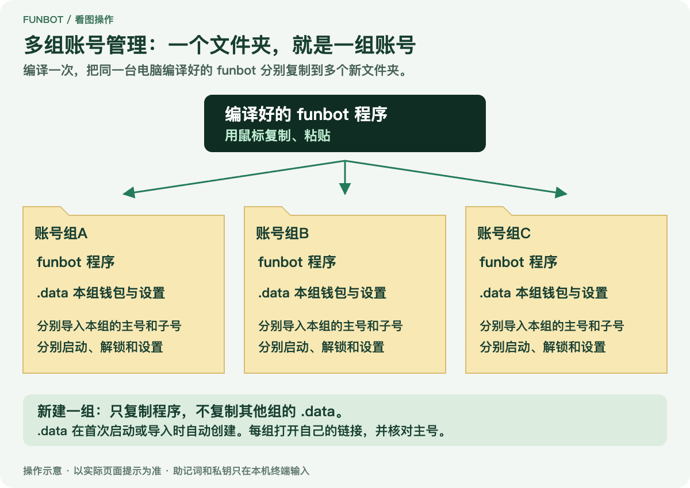

### 同时运行多组

每组保留自己的终端窗口，并打开对应窗口打印的网页链接。默认端口被占用时，程序会自动换端口。

打开页面后，核对主号地址，确认进入了正确的账号组。

## 日常使用

### 再次启动

在对应的 **账号组文件夹** 打开命令行，按系统启动：

Windows：

```powershell
.\funbot
```

Mac：

```sh
./funbot
```

用本次链接打开页面并解锁即可，无需再次编译、导入或重复部署。

### 退出与备份

退出时先停止批量任务，查看有无待确认交易，再在终端按 `Ctrl + C`。关闭网页不会停止程序，已经广播的交易也不会因退出而撤销。

钱包与设置保存在程序旁边的 `.data`。退出后，备份整个 `.data`。

- **Windows** — 在账号组文件夹地址栏追加 `\.data` 打开。
- **Mac** — 在访达按 `Command + Shift + .` 显示隐藏文件。

### 更新与搬家

**更新程序**：下载新源码并执行 `go build .`。退出旧程序后，用新程序替换旧程序，保留各组的 `.data`。

**移动文件夹**：退出程序后，移动整个账号组文件夹。更换电脑时，如果系统或芯片不同，需要在新电脑重新编译程序，再迁移 `.data`。

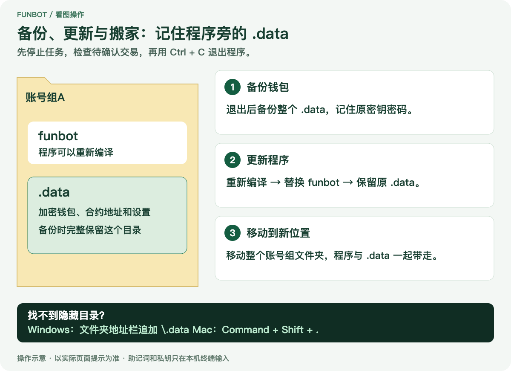

## 常见问题

### 安装与编译

**找不到 Go，或提示版本太旧**

安装 Go 1.26.8 或更高版本。关闭旧命令行，重新打开后执行 `go version` 检查。

**编译找不到 `go.mod`**

进入能直接看到 `go.mod`、`main.go`、`public` 的源码文件夹，再执行 `go build .`。

**一直显示 `downloading`**

首次编译需要下载依赖，请先等待。网络超时后检查网络，再重试编译命令。

**找不到编译好的程序**

回到源码文件夹，查找新增的 `funbot`。Windows 中类型为「应用程序」，Mac 中为「Unix 可执行文件」。

### 启动与使用

**移动程序后，命令找不到文件**

在账号组文件夹重新打开命令行，不要继续停留在原源码目录。

**输入密码没有反应，或提示密码不对**

密码输入不回显，填完按回车，不要重复粘贴。

已有钱包需要使用原密钥文件密码，不能在这里设置一个新密码。

**网页打不开或令牌错误**

使用本次启动打印的完整链接，包括 `?t=...`，并保持终端运行。

**部署或准备失败**

查看执行日志，检查本链 Gas、师父资格和账号准备状态。

更多说明：[钱包导入、Git 更新、取消委托、裁决规则与代码审核](docs/REFERENCE.md)。

## 安全说明

助记词和私钥只在终端提示处输入。不要写在命令后面、粘贴到网页或发到 Issue；网页派生使用本机已加密保存的助记词。

请保存好密钥文件密码和原始钱包备份。本工具会签署主网交易，需要保护电脑和主号；源码公开与本地加密不代表没有风险。

## 许可证

采用 [MIT 许可证](LICENSE)，第三方依赖保留各自许可证。

安装参考：[Go 官方说明](https://go.dev/doc/install) · [WinGet Go 清单](https://github.com/microsoft/winget-pkgs/tree/master/manifests/g/GoLang/Go) · [Homebrew Go](https://formulae.brew.sh/formula/go)。
