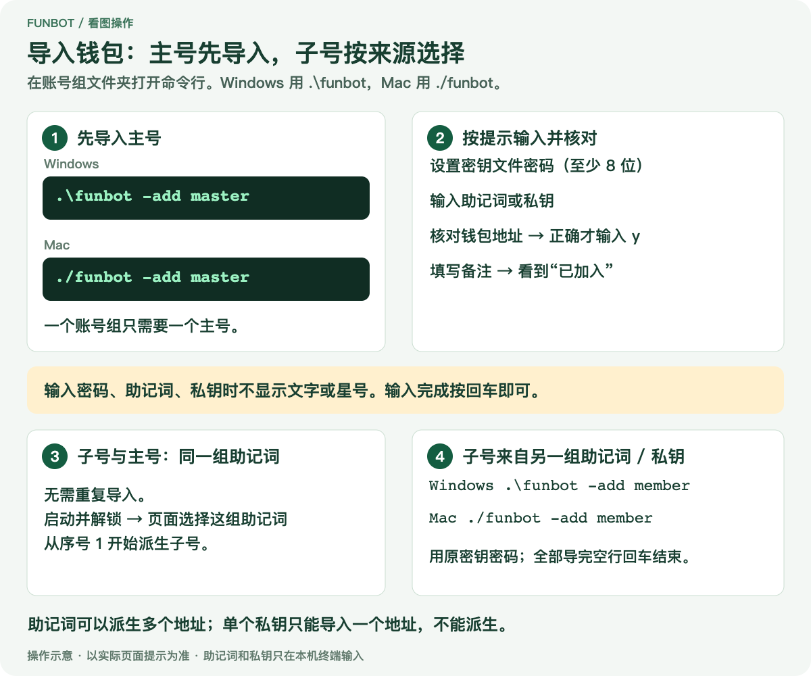

# 使用与审核参考

[返回新手教程](../README.md)

第一次使用请先完成新手教程里的 Windows 或 Mac 步骤。这里供管理账号、排查问题和审核代码时查阅。

## 终端输入说明

首次导入时设置本地密钥文件密码，至少 8 位，建议使用足够长且不重复的密码；以后导入、派生和解锁都使用同一个密码。程序不能找回密码。

助记词单词用空格分隔，也可以输入单个钱包的私钥。输入时不显示文字或星号；按回车后才显示助记词单词数或私钥长度。Windows 可以用 `Ctrl + V` 或右键粘贴；Mac 使用 `Command + V`。



普通助记词导入保存第 0 个地址；派生路径为 `m/44'/60'/0'/0/i`。显示的地址与原钱包不一致时，输入 `n`，先核对路径、序号以及原钱包是否使用额外助记词口令。只有地址正确才保存。

## 从终端派生子号

在对应账号组文件夹打开命令行。

Windows：

```powershell
.\funbot -add derive
```

Mac：

```sh
./funbot -add derive
```

按提示输入密钥文件密码、助记词、起始序号和数量，核对地址后保存。

| 场景 | 起始序号 | 数量示例 |
| --- | --- | --- |
| 已导入第 0 个地址，再添加 23 个子号 | `1` | `23` |
| 使用另一组尚未导入的助记词添加 24 个子号 | `0` | `24` |

建议先按新手教程导入主号，再派生子号。私钥不能派生。新增账号仍需委托、加入名册、拜师和授权。

## Git 下载与更新（可选）

**按新手教程下载 ZIP 的用户可以跳过本节。** 更新时重新下载源码、执行 `go build .`，再替换账号组里的程序并保留 `.data` 即可。

已安装 Git、希望使用 Git 下载源码的用户，可以在选定的父文件夹执行：

```sh
git clone https://github.com/fun-tool/funbot.git
cd funbot
```

**只有最初用 `git clone` 下载源码，之后需要更新时，才执行下面的命令。** 在包含 `go.mod` 的源码文件夹打开命令行，不是在账号组文件夹执行：

```sh
git pull --ff-only
```

更新后执行 `go build .`。退出账号组里的旧程序并备份 `.data`，再把新编译的程序复制进去替换旧程序，保留原 `.data`。

`--ff-only` 表示只接受快进更新；出现冲突或分叉会停止，不自动合并。提示目标文件夹已存在时，先检查是否就是原来的项目，不要直接删除。

## 如何取消 EIP-7702 委托

先停止正在运行的任务，在「设置 → 账号设置」勾选账号或选择范围，然后点击「取消选中账号委托」，核对提示后确认。空选不会操作，也不会自动带上主号；未委托的账号会跳过。

取消是一笔由主号支付 Gas 的链上交易。程序按 [EIP-7702 规范](https://eips.ethereum.org/EIPS/eip-7702#behavior) 签署目标为零地址的授权，并在交易确认后逐个读取链上代码，核实委托已经清除。

取消后钱包、名册和擂台资金仍保留，不会自动领取收益或归集，也不会撤销 ERC-20 代币授权。需要由机器人收款的，可以先按需要手动领取归集，再取消委托。若取消了主号委托，整队批量操作会暂停；重新委托主号后可以恢复。钱包私钥本身的控制权不受影响。

## 分组和两种入场方式

设置与运行页面按保存顺序每 24 个账号分组。「选本组」可以叠加选择多个组，最后一组可以不足 24 个。设置里先选账号，再执行委托、加入名册、拜师授权或取消委托。运行页也支持跨组选中；分组不限制交易大小，Gas 允许就合并为一笔。拜师授权使用现有合约的名册区间接口，不连续的名册区间可能分成多笔。

主号参加比赛时放在第一组第一个位置，并占一个名额；不参加比赛时独立显示在最上面，其余账号每组 24 个。运行中不能调整主号参赛设置。

| 入场方式 | 行为 |
| --- | --- |
| 等齐再打 | 等选中账号都满足入场条件，整批模拟确认全部能入场才提交。子号余额不足可由主号补币；Gas 超限时提示减少选择，不擅自拆分。 |
| 能打就打 | 可执行的账号先入场；整批模拟不通过时检查可执行子集，Gas 超限可分批。选 1 时不等待占位账号补打。 |

账号列表的「盟主次数」为该地址累计已裁决的胜出次数，读取失败显示「—」。已完成本次目标场次的账号不会自动额外补位。

一笔交易中的账号依次处理，可能跨越竞技场局号。「等齐再打」不表示必须进入同一局。交易确认后按实际入场事件核对；若上链结果与模拟不同，停止并提示核查，不盲目重发。

## 封盘、裁决与入场资金

仍在当前局内的账号不能重复进入同一局。但如果选中账号中已有足够的空闲号补满当前局，程序会把这些号排在前面，再让原先在局内的号进入下一局。例如当前 22/24 席，选中的两个空闲号先补满，后面的账号就可以继续入场；「等齐再打」会模拟整个顺序，全部通过才提交，无需等到所有号在交易前都空闲。账号数量不足以补满时仍需等待其他玩家。

封盘切换局号与裁决是两件事。旧局在区块 B 封盘后，通常到 B+2 就能由新的入场操作推动裁决，不必先领取回款；同一笔交易刚封盘的局不能立即裁决，后续账号需要的入场资金仍按模拟结果判断。程序会读取局状态、封盘区块和最近场次，满足条件后整批模拟；不会仅因旧局尚未显示「已裁决」就一直等待。

裁决按链上队列顺序推进，不会把「到了 B+2」当成回款已到账。程序模拟真实执行顺序：前面的入场可能推动裁决，后面的账号可能随即使用回款。未结算押金不会直接加进钱包余额，也不会把每个人都固定按补 100 相加。冠军甲子俸额度不等于即时可用回款。

当前合约会先检查子号钱包并补差额，再调用入场推动裁决。因此第一个账号可能先收到补币，随后改用到账回款入场，补进去的币保留在该账号钱包。这不是自动归集，也不会额外领取甲子俸或师承收益。

等待期间仅查询新区块，状态变化后再检查入场条件。每次连续等待最多 20 分钟；查询失败或超时会显示原因并结束，随时可点停止。如果全场只有 10 个号占位，仍需其他玩家补齐 24 席，等区块不会让未满的局自行封盘。

整批模拟与 Gas 预估并行执行，并按最终 Gas 再核实入场数量。日志显示检查区块、可执行数量、模拟补币金额和实际入场结果。模拟失败时不会广播交易；请按原因检查主号资金、委托、授权和当天上限后重试。

## 主网配置与许可

| 项目 | 当前配置 |
| --- | --- |
| 网络 | Anubis，chain ID `6714` |
| 游戏 Arena | `0xff060bAB41e16eBF0eFE4FAd454404Fd5f75aAaA` |
| fLGNS | `0xffFfBe730E2CdE54D8928D36F547e41DEb66Aaaa` |
| Lineage | `0xB84B4ADf44DDa95fceA681A91Ea78dAD341DB395` |

上面是游戏公共配置。页面「合约」栏应填自己的 Squad 地址。参数帮助：Windows 使用 `.\funbot -help`，Mac 使用 `./funbot -help`。

本项目采用 [MIT 许可证](../LICENSE)，第三方依赖保留各自许可证。教程配图为操作示意，不含真实助记词、私钥或交易信息。

## 给代码审核者

| 内容 | 入口 |
| --- | --- |
| 启动、主网配置 | `main.go`、`state.go` |
| 终端导入、加密、文件权限 | `import.go`、`keystore*.go`、`secure_file*.go` |
| 本机接口与访问校验 | `server.go`、`setup_handlers.go` |
| 交易签名、7702 委托、待确认交易恢复 | `chain.go`、`delegate.go`、`pending.go` |
| 批量打局、转入与归集 | `runner.go`、`batch.go`、`funding.go`、`jiazi.go` |
| 合约源码与内嵌 ABI、字节码 | `contracts/Squad.sol`、`squad_gen.go`、`trusted_squad.go` |

私钥在本机签名，RPC 接收查询和已签名交易。网页不接收助记词或私钥；解锁密码通过本机接口交给程序。密钥文件使用 go-ethereum 的 Keystore V3 加密组件，封装的是本程序的钱包集合，不能当成单账户 keystore 直接导入其他钱包。

合约内嵌字节码的编译参数为 Solidity `0.8.28`、EVM `cancun`、优化开启且 `runs = 200`、`viaIR = false`、`metadata.bytecodeHash = "none"`、`metadata.appendCBOR = false`。程序载入 Squad 时会核对运行时代码及主号、游戏合约等配置。修改 Solidity 后必须同步生成 ABI、字节码和 immutable 偏移，否则不能作为同一可信版本使用。

钱包在本机解锁使用，密钥文件加密保存。程序会在上锁和退出时主动清理敏感数据；受 Go 运行时和依赖库机制限制，部分临时内存副本可能无法同步清除。
